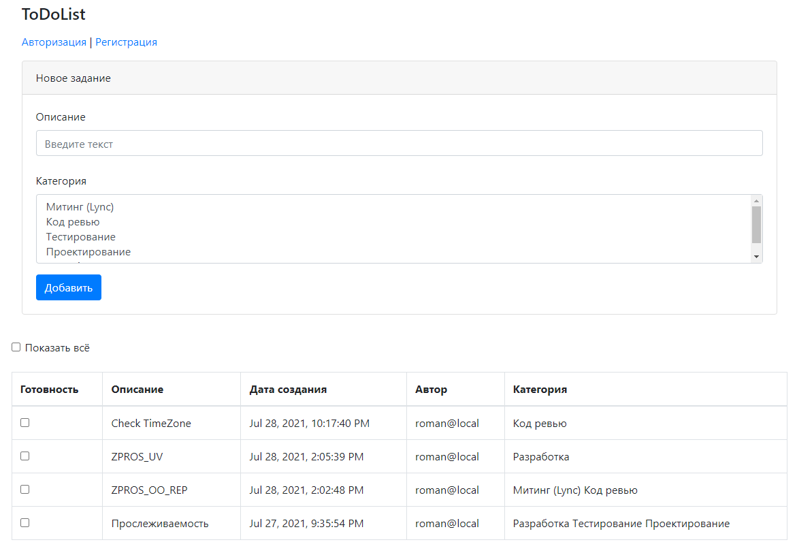
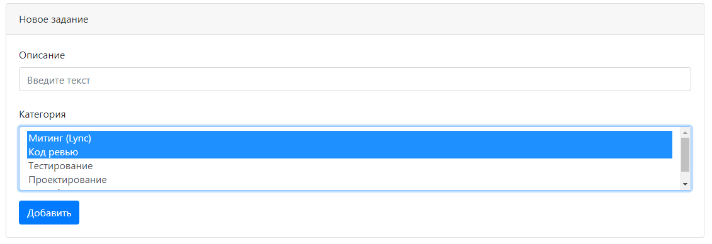

# job4j_todo

**To-do list**

В системе есть возможность добавлять новые задания.
 Можно отобразить на список как со всеми заданиями,
 так и только с невыполненными.

## Возможности

*Стартовая страница*  
 

*Добавление новой страницы*  

*Список всех заданий*  
